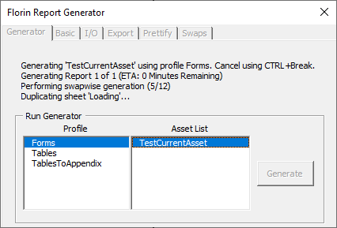

## About Me

I'm a software engineer and I make things! (supposedly)
I like tile and voxel-based games, crowd-built open source projects, and the beauty of good, well-documented automation.

### Projects

**Florin** - An automated, workbook-independent report generation system. Fully configurable generation of PDFs or tables from a given list of inputs, with options for showing specific sheets, hiding specific rows, applying AutoFit, automatically inserting photos of a given filename, and automatically duplicating sheets to generate a pdf with multiple pagess created from the same sheet formulae. Configurations are saved into the workbook itself. Full logging + debugging support.

#### Toys and Gizmos

[**HerrahStrings/Scrapped-Games**](./scrapped-games) - A small collection of jam-style games/ports I made in VB.NET in high school, as well as one or two written in C++ in uni

[**HerrahStrings/Packwiz-Packs**](./packwiz-packs) - A collection of modpacks for modern [Minecraft](https://www.minecraft.net) written using [comp500/packwiz](https://github.com/comp500/packwiz)

### Contact

By email! It's `first name [dot] "herrah" [dot] last name at gmail [dot] com`
