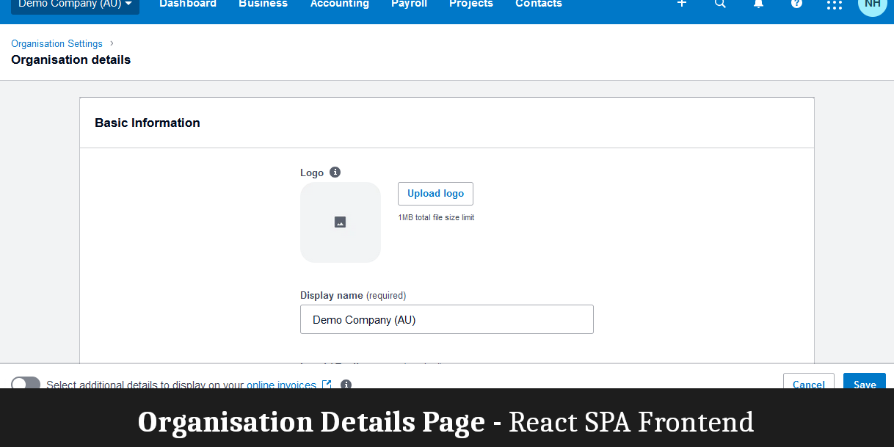
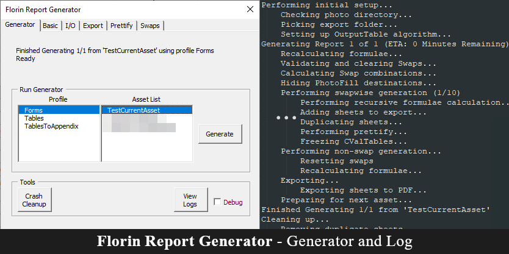
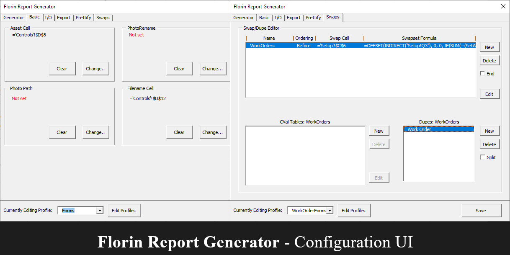
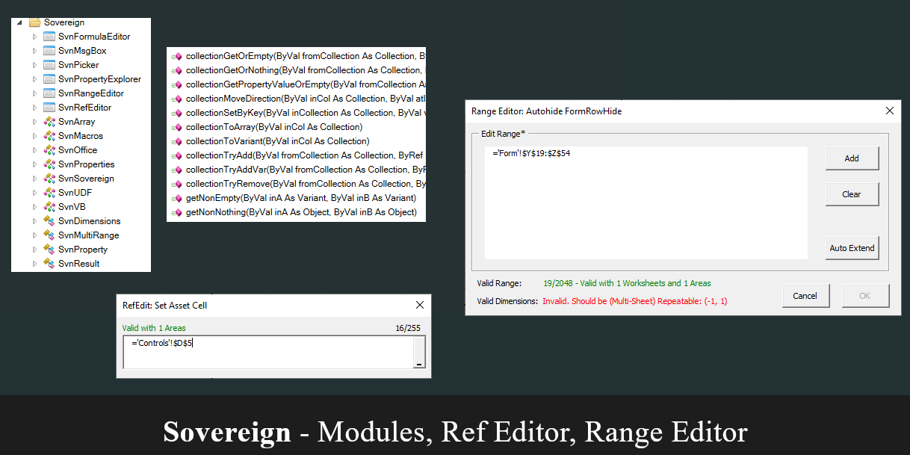
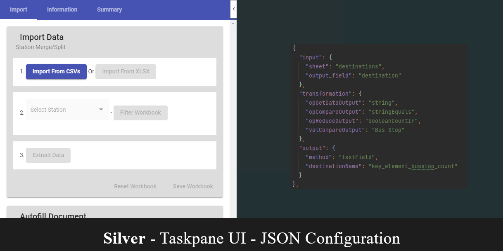
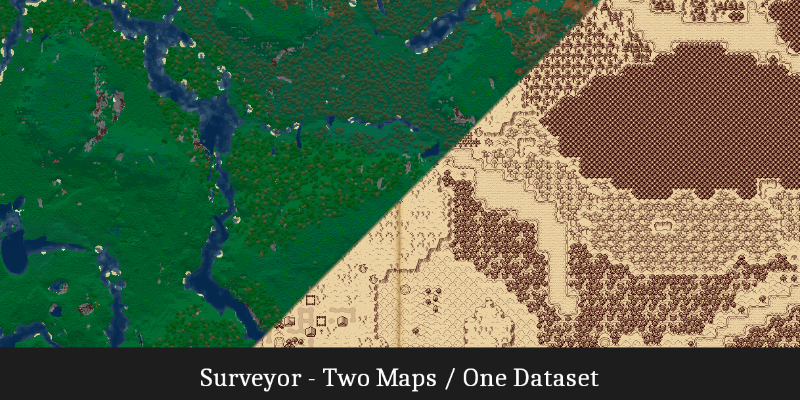
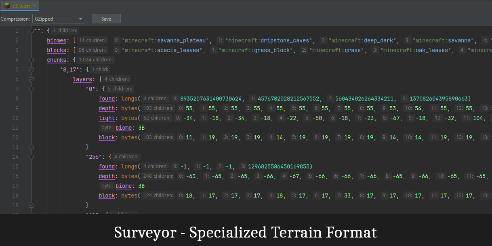
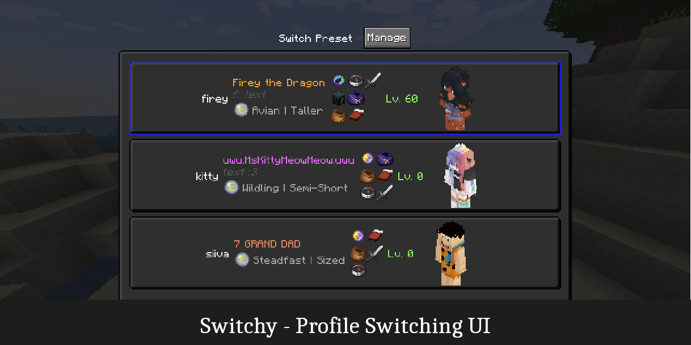
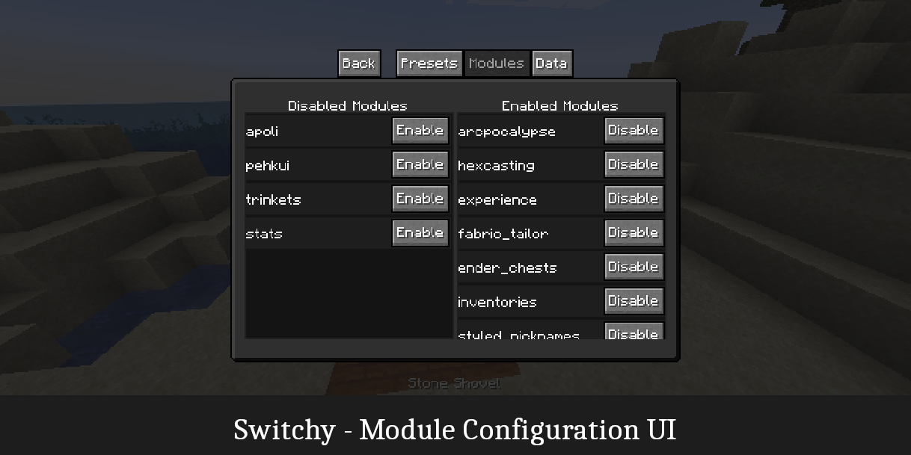

Hi! I'm a software engineer and I make things (supposedly)

## Professional Projects

### For a SAAS Provider:

<table>
    <tr>
        <td><b>Organisation Details Page</b></td>
        <td>A single page application for editing business-related account information.</td>
    </tr>
</table>

<table>
    <tr>
        <td></td>
        <td>Typescript React Redux .NET Core REST React Hook Form</td>
        <td>A rich webform with a few complex components. Includes address search and SMS verification.  Instant validation feedback with RHF.</td>
    </tr>
</table>

### For a Civil Engineering Firm:

<table>
    <tr>
        <td><b><a href="https://github.com/sisby-folk/florin">Florin Report Generator</a></b></td>
        <td>A fully data-driven & workbook independent automated report generation system.</td>
    </tr>
</table>

<table>
    <tr>
        <td> </td>
        <td>VBA Excel Winforms</td>
        <td>Turns template workbooks into report generators, with PDF/Table output. Generated 300+ PDF reports from one template & input table without user intervention. Configured via GUI, saved in a bespoke key-value DB made from named ranges and custom properties. Options for sheet & row visibility, autofit, inserting images. Can temporarily duplicate sheets for >1 page per template.</td>
    </tr>
</table>

---

<table>
    <tr>
        <td><b><a href="https://github.com/sisby-folk/sovereign">Sovereign VBA Library</a></b></td>
        <td>A library that improves the usability of VB6, VBA, VBA-Excel, and VBA-Word.</td>
    </tr>
</table>

<table>
    <tr>
        <td></td>
        <td>VBA Excel Winforms Word</td>
        <td>Improves collection handling, null-checking, string manipulation. Adds a system for meaningful sub returns. Validated range data with size & shape constraints. Refeditor that provides user feedback on the shape and validity of the range. Range editor that supports ranges spanning multiple sheets.</td>
    </tr>
</table>

---

<table>
    <tr>
        <td><b><a href="https://github.com/HestiMae/silver">Silver, Report Writer's Assistant</a></b></td>
        <td>A data-driven data manipulation & report-filling add-in for Word online.</td>
    </tr>
</table>

<table>
    <tr>
        <td></td>
        <td>Typescript Node.JS Angular.JS Office.JS JSON <a href="https://github.com/SheetJS/sheetjs">SheetJS</a></td>
        <td>Parses CSV and XLSX files, extracts data & outputs into Word JSON-powered configuration per-field with aggregation, conditions, etc. Outputs to Word fields or HTML cards.</td>
    </tr>
</table>

## In my own time

### Modding the game *Minecraft* in Java
**Minecraft** is a real-time multiplayer 3D video game, meaning all systems are heavily event-driven, and mods (implemented in the trait and bytecode-weaving framework [Mixin](https://github.com/SpongePowered/Mixin)) require both client-server networking implementations and a focus on performance.

*These projects are open-source - licensed as LGPLv3, as is standard for GPL minecraft mods.*

<table>
    <tr>
        <td><b><a href="https://github.com/sisby-folk/surveyor">Surveyor Map Framework</a></b></td>
        <td>A heavy-duty framework for creating world-map and minimap mods.</td>
    </tr>
</table>

<table>
    <tr>
        <td> </td>
        <td>Java JSON Mixin Fabric</td>
        <td>Scans the world as it generates, creating a thin slice for top-down maps.  Stores its data in a bespoke universally-applicable format. Uniquely allows map data to be generated on the server. Tracks individual player exploration of the world. Enables live map sharing & client data restoration.</td>
    </tr>
</table>

---

<table>
    <tr>
        <td><b><a href="https://github.com/sisby-folk/switchy">Switchy Player Profiles</a></b></td>
        <td>An addon-driven, modular, swappable player profiles mod</td>
    </tr>
</table>

<table>
    <tr>
        <td> </td>
        <td>Java JSON Mixin Fabric</td>
        <td>Enables anything from outfit changes to multi-character RPG setups. Support for per-profile inventories, locations, etc. Leverages the existing ecosystem of established mods for player customizations. E.g. nicknames, skins, player accessories, RPG classes. All settings configurable on a per-player level.</td>
    </tr>
</table>

---

... and [many more](https://modrinth.com/user/sisby-folk).

### Other

Also see my small [scrapped games/](/scrapped-games) collection of jam-like games made a long time ago in VB.Net, Java, and C++.

## Contact

However you got here!
